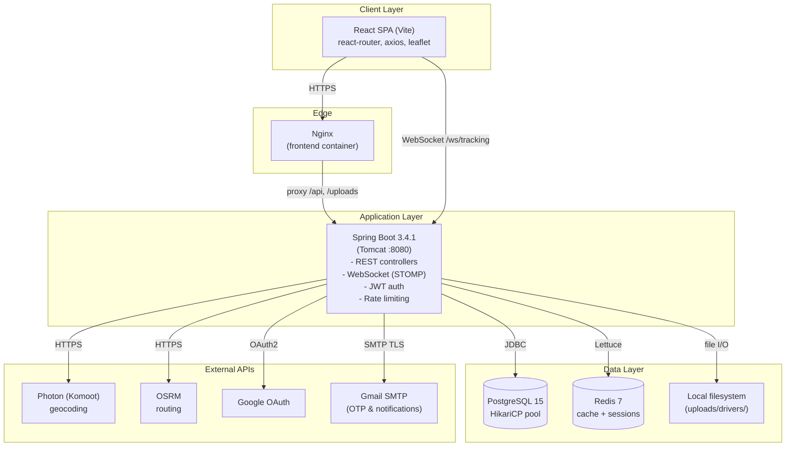
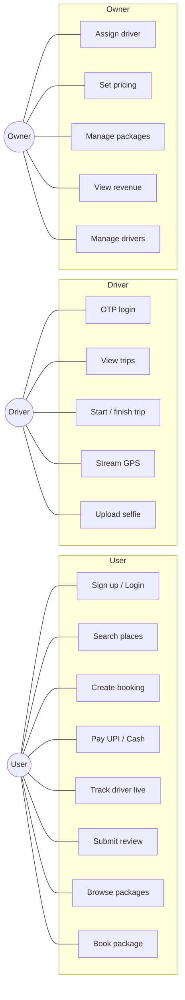
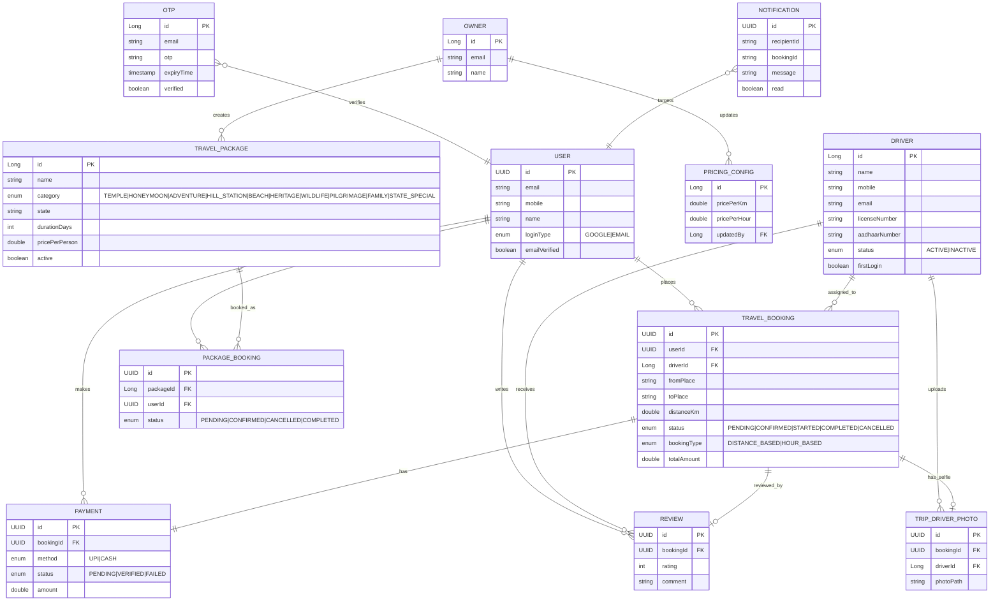
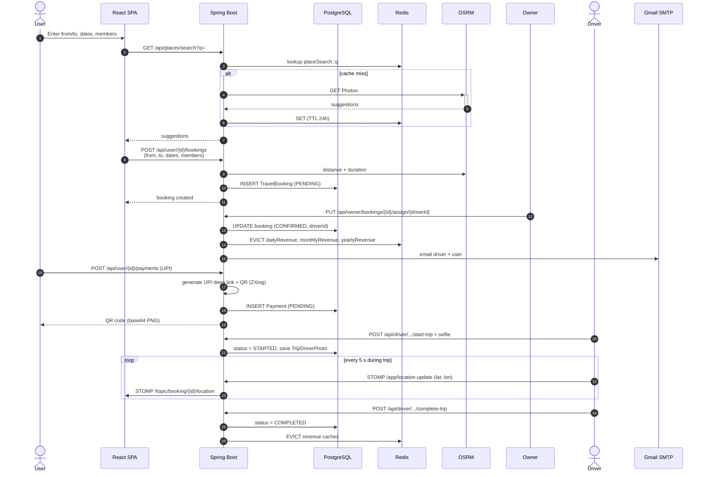
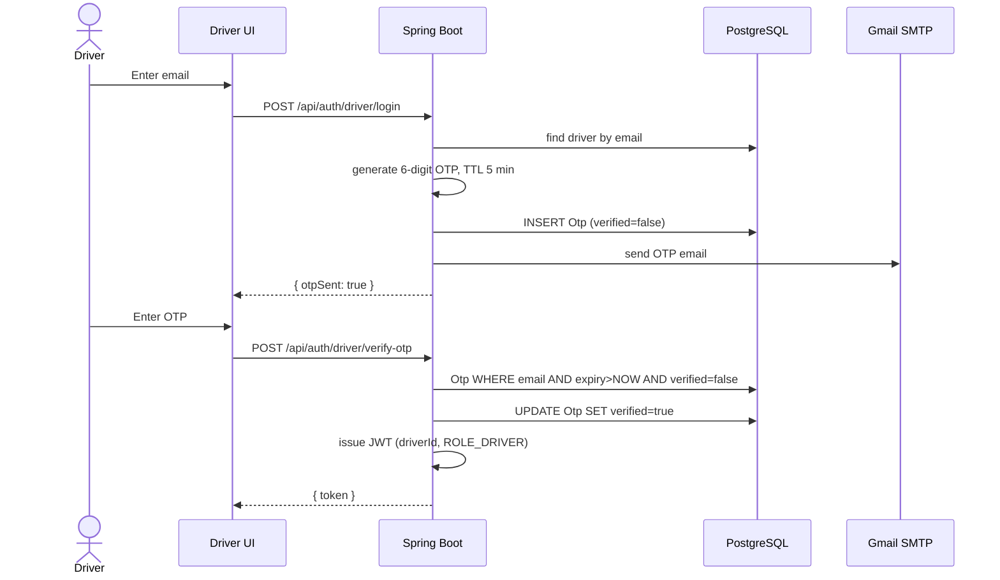
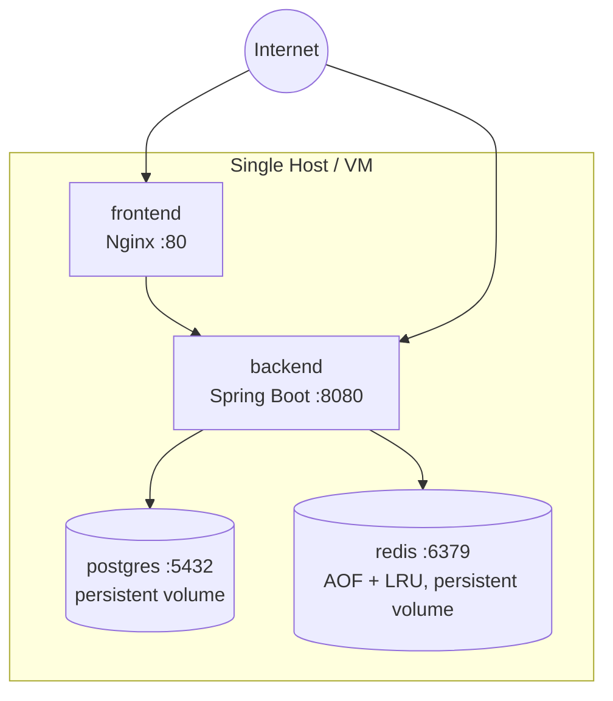
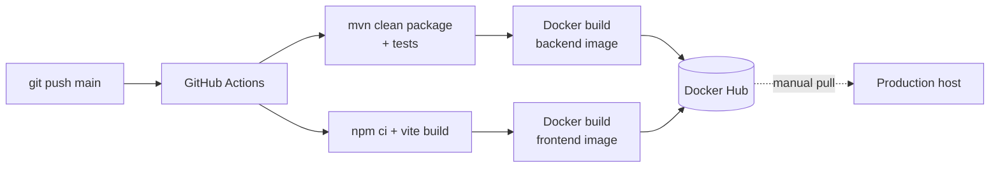

# High-Level Design — Namma Journey (Travel Booking Platform)

> **Status:** Living document — reflects code as of commit `223dc79` on `main`.
> **Scope:** Product goals, architecture, data model, workflows, deployment, scaling, and resilience. Excludes class-level and DB-column-level details (those belong in LLD).

---

## Table of contents

1. [Overview](#1-overview)
2. [Functional requirements](#2-functional-requirements)
3. [Non-functional requirements](#3-non-functional-requirements)
4. [System architecture](#4-system-architecture)
5. [Tech stack](#5-tech-stack)
6. [Actors & use cases](#6-actors--use-cases)
7. [Domain model (ER)](#7-domain-model-er)
8. [Core workflows](#8-core-workflows)
9. [API surface](#9-api-surface)
10. [Caching architecture](#10-caching-architecture)
11. [Security architecture](#11-security-architecture)
12. [Real-time tracking](#12-real-time-tracking)
13. [Deployment architecture](#13-deployment-architecture)
14. [Scaling strategy](#14-scaling-strategy)
15. [Resilience & failure model](#15-resilience--failure-model)
16. [Observability](#16-observability)
17. [External dependencies](#17-external-dependencies)
18. [Future roadmap](#18-future-roadmap)

---

## 1. Overview

**Namma Journey** is an Indian car-travel booking platform connecting three actors:

| Actor | Purpose |
|-------|---------|
| **User** (Customer) | Books car trips, pays via UPI/cash, tracks driver live |
| **Driver** | Accepts assigned bookings, streams GPS location, collects cash or confirms UPI |
| **Owner** (Admin) | Manages drivers, pricing, packages; sees revenue & reviews |

The platform covers one-off distance/hour-based bookings **and** pre-built travel packages (temple circuits, heritage tours, hill stations, etc.).

**Primary value propositions:** Live GPS tracking, verified drivers (Aadhaar + License), transparent per-km pricing, UPI-first payments.

---

## 2. Functional requirements

### 2.1 User
- Sign up / log in (email+OTP or Google OAuth)
- Search & book one-off trips (distance-based or hour-based)
- Browse & book pre-built travel packages by category/state
- Pay via UPI (QR code) or cash
- Track assigned driver in real time during the trip
- View booking history, payments, and submit reviews

### 2.2 Driver
- OTP-based login (email verification)
- View assigned bookings
- Accept / start / complete trips
- Stream GPS location to the customer during active trips
- Upload a trip-start selfie for accountability
- View/edit profile (license, photo, Aadhaar)

### 2.3 Owner / Admin
- Create driver accounts (with document upload)
- Assign drivers to bookings
- Set per-km and per-hour pricing
- Create / edit travel packages (category, state, price, itinerary)
- View daily / monthly / yearly revenue
- Moderate reviews and approve payments

### 2.4 Public (unauthenticated)
- View packages
- Place autocomplete (Photon API)
- Route preview (OSRM)
- Health probes

---

## 3. Non-functional requirements

| Category | Target | Mechanism |
|----------|--------|-----------|
| **Latency (P95, cached endpoints)** | < 150 ms | Redis per-cache TTLs (see §10) |
| **Latency (P95, uncached writes)** | < 500 ms | HikariCP pool (min 5 / max 20), batched JPA inserts |
| **Availability** | 99% single-region | Docker Compose stack, actuator health checks |
| **Throughput (API)** | ~50 RPS per pod | Tomcat 200 threads, async executor 4–16 |
| **Throughput (auth endpoints)** | 10 req/min per IP | Bucket4j rate limiter |
| **Security** | JWT + BCrypt + HTTPS (edge) | Spring Security filter chain |
| **Data durability** | RPO 24h | PostgreSQL volume, Redis AOF persistence |
| **Cache TTL correctness** | Eventual consistency on writes | `@CacheEvict` on all mutating service methods |

---

## 4. System architecture

### 4.1 Component diagram



### 4.2 Layering inside the Spring Boot app

```
Controller   (REST endpoints, DTO validation)
  │
Service      (business logic, @Transactional, @Cacheable)
  │
Repository   (Spring Data JPA interfaces)
  │
Entity       (JPA entities, mapped to PostgreSQL)
```

Cross-cutting concerns as filters / interceptors:
- `JwtAuthenticationFilter` — token validation + `SecurityContext` population
- `RateLimitingFilter` — Bucket4j per-IP (pre-auth)
- `WebSocketAuthInterceptor` — JWT on STOMP `CONNECT`
- `@Cacheable / @CacheEvict` — AOP-driven Redis access
- `GlobalExceptionHandler` — consistent error envelope

---

## 5. Tech stack

### Backend
| Layer | Technology |
|-------|-----------|
| Language / JVM | Java 17 |
| Framework | Spring Boot 3.4.1 |
| Web | Spring Web + Spring WebSocket (STOMP/SockJS) |
| Security | Spring Security 6 + JWT (jjwt 0.12.3) + BCrypt |
| Persistence | Spring Data JPA + Hibernate 6 |
| Database | PostgreSQL 15 (HikariCP) |
| Cache | Redis 7 (Lettuce) + Caffeine fallback |
| Rate limit | Bucket4j 8.7 |
| Routing engine | GraphHopper 8.0 (embedded, disabled) + OSRM (external) |
| Mail | Spring Mail (Gmail SMTP + STARTTLS) |
| QR codes | Google ZXing 3.5 |
| Monitoring | Actuator + Micrometer + Prometheus |
| Build | Maven |

### Frontend
| Layer | Technology |
|-------|-----------|
| Framework | React 18.2 |
| Build | Vite 5.1 (esbuild, manual chunk splitting, lazy routes) |
| Routing | React Router 6.22 |
| HTTP | Axios (JWT interceptor + 30 s in-memory GET cache) |
| Styling | Tailwind CSS 4 |
| Maps | Leaflet 1.9 + React Leaflet 4.2 |
| Real-time | @stomp/stompjs + SockJS |
| Auth | @react-oauth/google |
| Exports | jsPDF, xlsx |

### Infrastructure
- Docker + Docker Compose (`postgres`, `redis`, `backend`, `frontend`)
- GitHub Actions (CI build + Docker Hub push)
- Eclipse Temurin JRE 17 base image

---

## 6. Actors & use cases



---

## 7. Domain model (ER)



> **Schema evolution:** The application currently uses Hibernate `ddl-auto: update` (no Flyway migrations on disk). For production stability, this should be migrated to a versioned Flyway baseline before any schema-breaking change. See §18.

---

## 8. Core workflows

### 8.1 Booking → Assignment → Payment → Tracking



### 8.2 Driver OTP login



---

## 9. API surface

All REST endpoints live under `/api`, grouped by audience. Full list in controllers under `src/main/java/com/travelplatform/controller/`.

| Group | Prefix | Auth | Rate limit | Notes |
|-------|--------|------|-----------|-------|
| Auth | `/api/auth/**` | permitAll | 10/min/IP | Login, signup, OTP for all three roles |
| Public | `/api/public/**`, `/api/places/**` | permitAll | 50/min/IP | Packages, place search, health |
| User | `/api/user/{userId}/**` | `ROLE_USER` | 50/min/IP | Bookings, payments, profile |
| Driver | `/api/driver/{driverId}/**` | `ROLE_DRIVER` | 50/min/IP | Assigned trips, GPS push, profile |
| Owner | `/api/owner/**` | `ROLE_OWNER` | 50/min/IP | Drivers, pricing, packages, revenue |
| Health | `/actuator/**` | permitAll (hardened in prod) | excluded | Health, metrics, Prometheus, caches |
| Files | `/uploads/**`, `/driverphoto/**` | permitAll | excluded | Static license/Aadhaar/selfie images |
| WebSocket | `/ws/tracking` | JWT on CONNECT | n/a | Live driver location |

**Response envelope:** Controllers return plain DTOs on success; errors go through `GlobalExceptionHandler` → `{ error, message, timestamp }`.

---

## 10. Caching architecture

**Primary:** Redis 7 (Lettuce client, JSON values, prefix `travelplatform::`)
**Fallback:** Caffeine in-process (`APP_CACHE_TYPE=caffeine` or Redis unreachable)

### Per-cache TTLs — defined in [`CacheConfig.cacheTtls()`](src/main/java/com/travelplatform/config/CacheConfig.java#L36-L52)

| Cache name | TTL | Evicted on |
|-----------|-----|------------|
| `pricing`, `hourlyPricing` | 12h | `setPricePerKm` / `setPricePerHour` |
| `publicPackages`, `publicPackageById`, `packagesByCategory`, `packagesByState`, `packagesByCatState` | 30m | `createPackage` / `updatePackage` / `togglePackageStatus` / `deletePackage` |
| `allDrivers`, `driverById` | 5m | (driver writes — future enhancement) |
| `dailyRevenue` | 3m | `assignDriver` |
| `monthlyRevenue` | 10m | `assignDriver` |
| `yearlyRevenue` | 30m | `assignDriver` |
| `placeSearch` | 24h | never (external data) |

**Cache-aside pattern** via Spring AOP (`@Cacheable` / `@CacheEvict`). Null values not cached (`disableCachingNullValues()`), transactional eviction (`transactionAware()`).

**Client-side cache** in `frontend/src/utils/api.js` — 30s in-memory GET cache to absorb duplicate requests across route transitions.

---

## 11. Security architecture

### 11.1 Authentication
- **Three separate auth flows** for User / Driver / Owner, all issuing the same JWT shape:
  - Payload: `userId`, `role`, `exp`
  - Signed with HS256 (`JWT_SECRET` env var)
  - TTL: `JWT_EXPIRATION` env var
- **User**: email + password (BCrypt) or Google OAuth 2
- **Driver**: email + OTP (6-digit, 5-min TTL, Gmail SMTP delivery)
- **Owner**: email + password; `firstLogin` flag forces password reset

### 11.2 Authorization
- `SecurityFilterChain` in [`SecurityConfig`](src/main/java/com/travelplatform/config/SecurityConfig.java):
  - `permitAll`: `/api/auth/**`, `/api/public/**`, `/api/places/**`, `/api/health`, `/actuator/**`, `/ws/**`, `/uploads/**`
  - All other `/api/**`: authenticated
- `JwtAuthenticationFilter` placed **before** `UsernamePasswordAuthenticationFilter`
- Role enforcement: URL-path-based (`/api/user/**` → `ROLE_USER`, etc.) — not yet annotation-based

### 11.3 Transport & CORS
- CORS: origins `http://localhost:5173`, `http://localhost:4173` (dev). Add prod origin via env-driven config before release.
- HTTPS terminates at the edge (Nginx / reverse proxy) — internal traffic is HTTP on the Docker network.

### 11.4 Rate limiting
- [`RateLimitingFilter`](src/main/java/com/travelplatform/config/RateLimitingFilter.java): 50 req/min general, 10 req/min on `/api/auth/**`. Buckets keyed by client IP, cleaned every 10 min.

### 11.5 Threats considered
| Threat | Mitigation |
|--------|-----------|
| Brute-force login | Rate limit 10/min on `/api/auth`, BCrypt password hashing |
| JWT replay | Short TTL; secret rotation via env var |
| OTP brute-force | 5-min TTL, single-use (`verified=true` after match) |
| SQL injection | JPA parameterized queries throughout |
| XSS | React escapes by default; no `dangerouslySetInnerHTML` in app code |
| CSRF | Disabled (stateless JWT API); verified no cookie-based session |
| File upload abuse | 5 MB per file, 20 MB per request, path confined to `uploads/drivers/` |

---

## 12. Real-time tracking

```mermaid
flowchart LR
    D[Driver app<br/>useDriverLocationSender] -- STOMP SEND /app/location.update --> WS[WebSocket /ws/tracking]
    WS -- broker --> BE[LocationWebSocketController]
    BE -- STOMP --> TOPIC[/topic/booking/{id}/location/]
    TOPIC --> U[User's LiveTrackingMap<br/>subscribe]
```

- **Transport:** SockJS fallback + STOMP frames
- **Endpoint:** `/ws/tracking`
- **Auth:** `WebSocketAuthInterceptor` validates `Authorization: Bearer <jwt>` on `CONNECT` and binds user into the STOMP session
- **Publish:** driver sends `{ lat, lon, timestamp }` to `/app/location.update` every ~5 s during an active trip
- **Subscribe:** user's UI subscribes to `/topic/booking/{bookingId}/location`
- **Broker:** Spring's built-in simple in-memory broker (single-pod). For multi-pod, swap to an external broker (RabbitMQ / Redis Pub-Sub relay) — see §14.

---

## 13. Deployment architecture

### 13.1 Container topology (docker-compose)



Configured in [`docker-compose.yml`](docker-compose.yml):
- `backend` depends on `postgres` and `redis` being healthy
- `redis` runs with `--appendonly yes --maxmemory 256mb --maxmemory-policy allkeys-lru`
- `postgres` has healthcheck `pg_isready`
- Shared bridge network `travel-network`

### 13.2 CI/CD pipeline



- Trigger: push to `main`
- Jobs: `backend` (build+test) → `frontend` (build) → `docker` (build & push images tagged `latest` + `${sha}`)
- Production rollout is **manual** today: `docker-compose pull && docker-compose up -d`

---

## 14. Scaling strategy

### 14.1 Vertical (today — single host)
- Tomcat threads: max 200, min-spare 20
- HikariCP: 5 min / 20 max
- Async executor: 4 core / 16 max / queue 100
- Redis memory: 256 MB with LRU eviction

### 14.2 Horizontal (roadmap)
| Concern | Change |
|---------|--------|
| Stateless API | Run ≥ 2 backend pods behind a load balancer — already stateless (JWT, no server session) |
| Sticky sessions for WebSocket | Either sticky LB or replace simple broker with **RabbitMQ STOMP relay** |
| Cache correctness | Already centralized in Redis — multi-pod safe |
| Database writes | PostgreSQL primary + read replicas for `/api/owner/revenue/**` and `/api/public/packages` |
| File uploads | Move `uploads/` to S3 / object store so pods don't share a local disk |
| Search | Swap OSRM public endpoint for self-hosted instance (SLAs) |

### 14.3 Read-path performance wins already in place
- Redis caches on revenue, drivers, packages, place search
- Response compression > 1 KB
- HTTP/1.1 keep-alive via embedded Tomcat
- Client-side code splitting + lazy routes

---

## 15. Resilience & failure model

| Failure | Impact | Mitigation |
|---------|--------|-----------|
| Redis down | Cache misses | Automatic fallback to Caffeine (`APP_CACHE_TYPE=caffeine`); reads continue |
| PostgreSQL down | All writes and most reads fail | Actuator marks unhealthy; LB should drain pod; manual failover for now |
| Photon API down | Place autocomplete empty | Controller returns `[]`; user can still type a free-form place name |
| OSRM API down | Distance calculation fails on booking create | Error surfaced to user; retry logic needed (TODO) |
| Gmail SMTP down | OTP emails not delivered | User must retry; email delivery is synchronous today (TODO: async via queue) |
| WebSocket disconnect | Live tracking stops | Frontend reconnects with backoff (SockJS built-in) |
| JVM OOM | Backend pod dies | Docker `restart: always` (add to compose); actuator health probe |

Graceful degradation philosophy: **reads degrade to stale cache or empty set; writes fail loud**.

---

## 16. Observability

Exposed via Spring Actuator ([application.yml:124-137](src/main/resources/application.yml#L124-L137)):

| Endpoint | Purpose |
|----------|---------|
| `/actuator/health` | Liveness + readiness (probes enabled) |
| `/actuator/metrics` | Per-metric drill-down |
| `/actuator/prometheus` | Prometheus scrape target |
| `/actuator/caches` | Cache names + entry counts |

**Key metrics to watch:**
- `http_server_requests_seconds{uri,method,status}` — latency & error rate
- `cache_gets_total{cache,result=hit|miss}` — cache efficiency per region
- `hikaricp_connections_active` — DB pool pressure
- `jvm_memory_used_bytes` — heap pressure
- `process_cpu_usage`

**Logging:** SLF4J + Logback; app logs at `INFO`, Security at `WARN` ([application.yml:109-112](src/main/resources/application.yml#L109-L112)).

**Gaps (TODO):**
- No centralized log aggregation (ELK / Loki) yet — logs live inside each container
- No distributed tracing (OpenTelemetry / Zipkin)
- No alerting rules (Alertmanager / Grafana alerts)

---

## 17. External dependencies

| Service | Purpose | Failure mode |
|---------|---------|--------------|
| **Photon (Komoot)** `photon.komoot.io` | Place search & geocoding | 24h Redis cache masks most outages |
| **OSRM** `router.project-osrm.org` | Road distance & duration | Booking creation fails; needs retry / self-host |
| **Google OAuth** | User social login | Users can fall back to email+OTP |
| **Gmail SMTP** `smtp.gmail.com:587` | OTP + booking notifications | Email queue + retry (planned) |
| **PostgreSQL** (managed or self-hosted) | System of record | Replace with managed RDS / Cloud SQL in prod |
| **Redis** (managed or self-hosted) | Cache + distributed rate limit (future) | Caffeine fallback built in |
| **Docker Hub** | CI image registry | Manual mirror on outage |

---

## 18. Future roadmap

Ordered by value-vs-effort:

1. **Flyway baseline migrations** — lock schema, stop using `ddl-auto: update` in prod.
2. **Centralized logging** — ship container stdout to Loki or ELK.
3. **Payment gateway** — replace manual UPI QR with Razorpay/PhonePe for auto-verification.
4. **Object storage for uploads** — move `uploads/drivers/` to S3 to unblock horizontal scaling.
5. **Email queue** — make OTP/booking emails async (Spring `@Async` is configured; queue persistence missing).
6. **Driver-trip auto-matching** — replace Owner-manual assignment with a scoring algorithm (distance, rating, availability).
7. **AI travel assistant** — Claude-powered chat on the landing page grounded in `TravelPackage` table.
8. **External message broker for WebSocket** — RabbitMQ STOMP relay to enable multi-pod deployment.
9. **OpenTelemetry tracing** — correlate API → DB → external-API spans.
10. **Feature flags** — roll out new flows per-role without redeploying.

---

## Appendix A — Environment variables

| Variable | Default | Purpose |
|----------|---------|---------|
| `DB_URL` / `DB_USERNAME` / `DB_PASSWORD` | — | PostgreSQL connection |
| `REDIS_HOST` / `REDIS_PORT` / `REDIS_PASSWORD` | `localhost` / `6379` / `""` | Redis connection |
| `APP_CACHE_TYPE` | `redis` | `redis` or `caffeine` |
| `JWT_SECRET` / `JWT_EXPIRATION` | — | JWT signing + TTL |
| `MAIL_USERNAME` / `MAIL_PASSWORD` | — | Gmail SMTP |
| `MAIL_FROM_NAME` | `Namma Journey` | From-name on OTP/notification emails |
| `OTP_EXPIRY_MINUTES` | `5` | OTP validity window |
| `OTP_TEST_MODE` | `false` | If `true`, returns OTP in API response (dev only) |
| `GOOGLE_CLIENT_ID` / `GOOGLE_CLIENT_SECRET` | — | Google OAuth |
| `FILE_UPLOAD_DIR` | `uploads/drivers` | Local filesystem upload root |
| `OWNER_UPI_ID` | `sarasarathy86@okicici` | UPI VPA receiving payments |
| `SERVER_PORT` | `8080` | Backend port |

## Appendix B — Ports (default)

| Port | Service |
|------|---------|
| `80` | Frontend (Nginx) |
| `8080` | Backend API + WebSocket |
| `5173` | Frontend dev server (Vite) |
| `5432` | PostgreSQL |
| `6379` | Redis |
